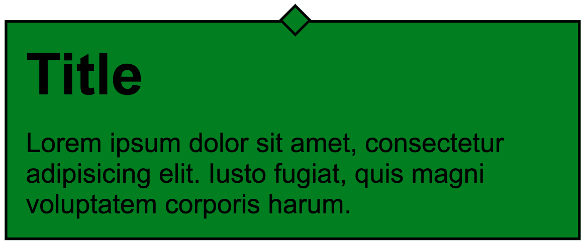

# Zadania

---
> **Uwaga!!!**
>
> Każde zadanie rozwiązujmy w oddzielnym pliku, który dołączajmy do pliku **main.scss**.
---

## Zadanie 1
Stwórzmy 2 zmienne z kolorami: **$color1** i **$color2**.

Za pomocą pętli i odpowiedniej funkcji sass stwórzmy 10 klas o nazwach 
**.color1**, **.color2**, **.color3**,  
które będą ustawiały **kolor tekstu** na coraz bardziej zmieszane oba kolory. 

Wykorzystajmy do tego odpowiednią funkcję sass.

## Zadanie 2
Stwórzmy mapę 5 kolorów. 

Za pomocą pętli wygenerujmy 5 klas o nazwach **.elem1**, **.elem2**, **.elem3** itp, którym dodamy kolejne kolory jako tła.

## Zadanie 3
Stwórzmy osobny plik **_mixins.scss** i dołączmy go do **main.scss**. 

W pliku tym napiszmy mixin **grad($color1, $color2)**, który przyjmie 2 parametry (2 kolory),  
a następnie wygeneruje kod dla liniowego gradientu, który będzie się układał pionowo od pierwszego koloru do drugiego.

Oba parametry powinny być nieobowiązkowe.  
Jeżeli nie są podane, wtedy pierwszy kolor powinien być biały, drugi czarny.

Po stworzeniu mixina dodajmy go dla body używając kolorów #fff i #eee

## Zadanie 4
Napiszmy mixin o nazwie **drawItem**, który przyjmuje dwa argumenty - kształt do narysowania, oraz kolor jego tła.

Jeśli przekazany kształt to circle - stworzy koło o wymiarach 100px na 100px  
Jeśli przekazany kształt to rectangle - stworzy kwadrat o wymiarach 200px na 200px 

Dodajmy mixin do elementów o klasach **.circle** i **.rectangle**.

## Zadanie 5
Stwórzmy mixin, o nazwie **dialogBox**, który przyjmuje dwa argumenty - kolor ($backgroundColor) oraz szerokość boksa ($width).
 
Jego zadaniem jest ustawienie styli dla elementu o klasie dialog.
* width: $width;
* padding: 10px;
* background: $backgroundColor;
* border: 1px solid black;
* margin: 40px auto;

Do mixinu dodajmy pseudoelement **:after**, który stworzy kwadrat o wymiarach 10x10px, dekorujący boks. 

Końcowy projekt powinien wyglądać następująco:

