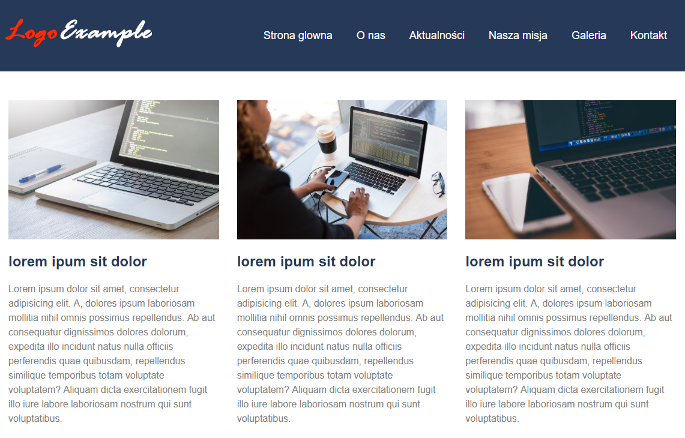
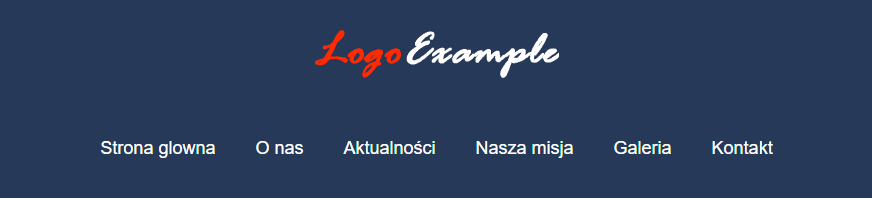
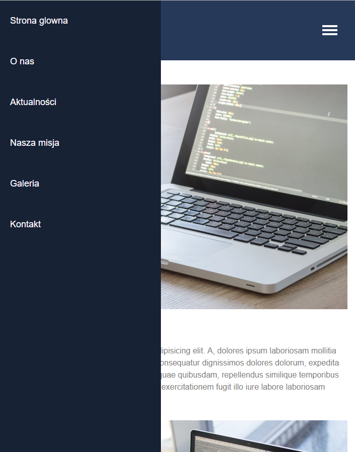

Zadania 
====================

W pliku index.html znajduje się kod przykładowej strony, którą musimy zrobić responsywną.

Zadanie 1
---------
Nadajmy nagłówkowi **.page-header** tło o kolorze zmiennej **$color** (granatowy) oraz wewnętrzny odstęp **10px** z każdej strony.  
Za pomocą flexboxa ułóżmy logo i nawigację po bokach i wycentrujmy je w pionie. 


Wewnątrz elementu **.main-nav** jest lista z linkami.   
Powinna ona być wyczyszczona (nie mieć marginesu, paddingu i kropek), a jej elementy powinny układać się obok siebie.  
Linki w tej liście powinny być białe, wielkości 18px, nie mieć podkreślenia i mieć wewnętrzny odstęp od góry i dołu po 20px, a po bokach 30px.   
Pamiętajmy, że linki domyślnie są inline, dlatego musimy im zmienić domyślne wyświetlanie.



Zadanie 2
--------- 
W elemencie **.page-main** znajdują się trzy przykładowe boxy.   

Ułóżmy je obok siebie. Między nimi powinien być odstęp 30px (gap).  
Możemy do tego celu wykorzystać grida z poprzednich rozdziałów, oraz dodać do html brakujący html (.container, .row i kolumny). 
Możemy też zastosować inne sposoby na układanie elementów obok siebie (floatów nie używajmy!).  

Dodatkowo za pomocą odpowiedniego stylowania sprawmy, by grafiki nie wystawały poza kolumny.


Zadanie 3
---------
Przy mniej więcej 1000px nasza nawigacja się psuje.   

---
> Nigdy nie róbmy breakpointów "pixel perfect". 
--- 
Tekst może się ciut inaczej wyświetlać na innych systemach (np. troszkę grubiej), dlatego lepiej breakpointy robić nieco z zapasem.  
Zróbmy więc nowe @media w okolicach 1050px i sprawmy by nawigacja leżała pod logiem.   

Zarówno logo i nawigacja powinny być wycentrowane w poziomie.



Zadanie 4
---------
Przy ok 780px nasza nawigacja psuje się ponownie.
 
Moglibyśmy tutaj jeszcze podziałać np. zmniejszając odstępy w linkach, ale wydaje się, że jest to dobry moment na stworzenie typowej nawigacji mobilnej opartej o **ikonę hamburgera**.  

Dodajmy do nawigacji (za listą ul) button o klasie **.main-nav-toggle**:

```html
<button class="main-nav-toggle" aria-label="Pokaż menu">
    <span></span>
    <span></span>
    <span></span>
</button>
```

Button powinien być rozmiarów 80x80px oraz nie mieć obramowania i tła. 
 
Wewnątrz niego powinny się znajdować 3 białe kreski o rozmiarze 30x4px.

Pamiętajmy, że w naszym przypadku są to spany, dlatego musimy zmienić im wyświetlanie na blokowe.


Na dużych rozdzielczościach button ten nie powinien być widoczny (display: none). 

Powinien się pojawiać na rozdzielczości do 780px. 

Napiszmy na dole stylów kolejne @media, w którym pokażemy nasz przycisk.

Zadanie 5
---------

Na małej rozdzielczości (do 780px) nawigacja powinna być ukryta, a po kliknięciu buttona wyjeżdżać spoza ekranu. 

Dla rozdzielczości do 780px element **.main-nav-list**
 - przyklejmy do lewej krawędzi ekranu dając mu pozycjonowanie fixed o pozycji 0x0, 
 - rozmiary: szerokość 320px i wysokość 100% ekranu. 
 
Nawigacja powinna mieć tło takie jak nagłówek strony, tylko ciemniejsze o 20%.   
Użyjmy tutaj odpowiedniej funkcji sass. 

Elementy w liście powinny układać się pionowo.

Dodanie position fixed dla listy sprawi, że na rozdzielczości do 780px widoczne w nagłówku będą tylko logo i button który stworzyliśmy powyżej. 

Ułóżmy je po obu stronach nagłówka.

Po wprowadzeniu tych zmian nasza mobilna nawigacja powinna wyglądać jak na poniższym screenie:



Zadanie 6
---------
Pozostaje nam stworzenie wyjeżdżania nawigacji.

W powyższym zadaniu dla rozdzielczości do 780px przykleiliśmy nawigację do pozycji 0x0. 

Zmieńmy jej pozycję x na -320px.


Po kliknięciu na button togglujemy jej dodatkową klasę np. **show**, którą wykorzystamy do wsunięcia nawigacji na ekran.

Poniższy kod pokazuje zasadę działania:

```scss
@media (max-width: 780px) {
    .main-nav-list {
        left: -320px;
        ...
    }
    .main-nav-list.show {
        transform: translate(100%); //przesuń o szerokość elementu w prawo
        //lub 
        //left: 0;
    }
}
```

Do strony dołączony jest plik app.js.  
Przeanalizujcie gotowy już kod skryptu js, odpowiedzialny za zdarzenie kliknięcia.

Znajdujemy za pomocą selektorów w nim 2 elementy - button i nawigację.   
Po kliknięciu na button togglujemy (czyli dodajemy gdy nie ma, a usuwamy gry jest) klasę **show** dla nawigacji.

Aby wjeżdżanie nawigacji było płynne, dodajmy jej właściwość **transition: 0.5s transform** lub **transition:0.5s left** w zależności, co wybraliśmy w powyższym kodzie.


 
