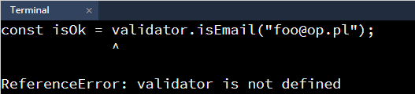

# Zadanie

## Dołączanie pliku
W Node.js każdy plik z kodem powinniśmy traktować jak oddzielne zamknięte pudełko. Żeby móc odwołać się do takiego kodu (np. do zmiennych, funkcji) powinniśmy ten plik dołączyć do naszego kodu.

W katalogu **JS** mamy dwa pliki. Nasz główny plik to **app.js**. 

Drugim plikiem jest **child.js**, w którym jest przykładowa funkcja **printText**. 

Żeby jej użyć w naszym głównym pliku, musimy plik **child.js** dołączyć do **app.js**.

```
//w pliku app.js
const print = require("./child.js");
print();
```

Po dołączeniu pliku **child.js** w terminalu odpalmy skrypt **app.js** poleceniem:

```
node js/app.js
```

## Dodawanie paczek npm do pliku
Kolejny test będzie polegał na użyciu zewnętrznej paczki validator, za pomocą której spradzimy, czy dany email jest poprawny.

Dodajmy do naszego projektu paczkę validator. Użyjemy z niej funkcji **isEmail(string)**. 

W pliku **app.js** dopiszmy więc następujący kod:

```
const print = require("./child.js");
print();

const validator = require("validator");
const isOk = validator.isEmail("foo@op.pl");
console.log(isOk);
```

a następnie odpalmy nasz plik w terminalu za pomocą ``node js/app.js``

W terminalu powinien pojawić się nam błąd:



Dlaczego wystąpił błąd? To dlatego, że odwołujemy się do paczki, której jeszcze nie zainstalowaliśmy. 
W oknie terminala instalujemy paczkę poleceniem:

```
npm install --save-dev validator
```

po czym odpalamy nasz skrypt ponownie. 

---
> Zauważmy jak podane zostały ścieżki do ploku **child.js** i paczki **validator**. Jeżeli ścieżka rozpoczyna się od pojedynczej lub podwójnej kropki (./ lub ../) oznacza to, że odnośimy się do naszego pliku js, wskazując jego miejsce relatywnie do pliku w którym piszemy. Jeżeli ścieżka nie zaczyna się od kropki (jak w przypadku validator), Node.js będzie szukał danej paczki w node_modules w katalogu o nazwie paczki. W naszym przypadku szukać będzie paczki w katalogu node_modules/validator.
---

Podobnie do powyższego możemy instalować dowolne paczki. Przykładowo chcielibyśmy w terminalu zapisać "true" żółtym kolorem. Aby to zrobić doinstalujmy kolejną paczkę czyli https://www.npmjs.com/package/ansi-colors

W terminalu wpisujemy:

```
npm install --save-dev ansi-colors
```

a następnie według instrukcji z tej strony przerabiamy nieco nasz skrypt w pliku app.js:

```
const print = require("./child.js");
print();

const validator = require("validator");
const isOk = validator.isEmail("foo@op.pl");

const c = require("ansi-colors");
console.log(c.yellow(isOk));
```

Chcielibyśmy teraz by buzia z funkcji printText była pisana zielonym kolorem. Pamiętajmy, że jeżeli dany plik chce użyć zewnętrznych funkcji/zasobów, każdorazowo musi je dołączać za pomocą polecenia **require**. Dodajmy więc do pliku **child.js** paczkę ansi-colors i podobnie do powyższego kodu zmodyfikujmy działanie funkcji printText:

```
//child.js

const c = require("ansi-colors");

function printText() {
  console.log("----------------------");
  console.log("Witaj w pliku child.js");
  console.log(c.green("(ღ˘⌣˘ღ)"));
  console.log("----------------------");
}

module.exports = printText;
```

Odpalmy w terminalu skrypt app.js (do poprzednich polecen wpisywanych w terminalu możemy wracać za pomocą strzałek góra-dół). Wszystko powinno działać jak należy.
