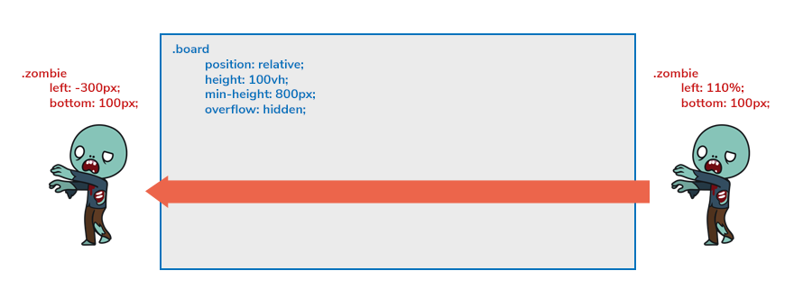

Zadanie
---------
Stwórzcie animację kroczącego zombie z wykorzystaniem CSS sprite.

Link do obrazka: http://www.wdrfree.com/public/demos/animatespritekeyframes/walkingdead.png

Podpowiedź: wymiary jednej klatki animacji 200x312 pixeli, ilość klatek: 10.

[Tutorial w razie pomocy](http://blog.teamtreehouse.com/css-sprite-sheet-animations-steps)


### Dodatkowe dla chętnych
Tak samo jak przy kilku innych właściwościach, tak i przy animacjach możemy do pojedynczego elementu dodać wiele animacji po przecinku np.
```
animation: myAnim1 3s 0s, myAnim2 5s 0s alternate;
```

Dodajcie dla zombie dodatkową animację, która wykona się **jeden raz** i przesunie go z prawej strony ekranu na lewą (i pozostawi go po lewej stronie).   
Zastosujcie tutaj odpowiednie właściwości dla animacji.   
Aby uzyskać takie przesunięcie zastosujcie dla zombie pozycjonowanie absolutne tak jak na poniższej grafice.  
Element **.zombie** powinien znajdować się wewnątrz elementu **.board**.   
Po zakończonej animacji zombie powinien być niewidoczny po lewej stronie planszy.



### Dodatkowe dla zaawansowanych

--- 
> **Do przerobienia po module JS obejmującym tworzenie elementów i zdarzenia**
---

Na chwilę obecną mamy tylko jednego zombie. 

Horroru z tego raczej nie będzie.  
Moglibyśmy ręcznie utworzyć naście takich stworów, ale możemy też zastosować mechanizmy, które już poznaliście na kursie.

Skorzystajmy tutaj z **setInterval**, w którym będziemy dynamicznie tworzyć kolejne potwory.  
 
Na początku usuńcie zombie z html, którego właśnie stworzyliśmy - będzie tylko przeszkadzał.

Dodajcie do katalogu plik app.js, w którym umieścicie kod:
- stwórzcie zmienną time, którą narazie ustawcie na null
- stwórzcie funkcję start w której:
    - pod zmienną **time** podstawcie setInterval (np. co 500ms), w którym:
        1) stwórzycie nowy element div, któremu nadacie klase .zombie
        2) wygenerujcie mu losową pozycję bottom (z przedziału np. 50-280). Pamiętajcie by do tej pozycji dodać "px"
        3) wygenerujcie mu losową szybkość animacji przejścia
        4) ustawcie mu właściwość ```style.animationDuration```.   
        Nadaliśmy naszemu zombie 2 animacje, wiec musimy podać tutaj czas obydwu animacji w formacie ```"1s, 5s"``` np. ```"1s, " + randomTime + "s"```
        5) za pomocą odpowiedniej funkcji JS dodajcie tak stworzony element .zombie do elementu **.board**
        6) w podobny sposób co powyżej możecie wygenerować właściwości style takie jak ```style.transform``` (np. scale), ```style.filter``` (np. blur) itp.
        
Odpalcie funkcję start poza jej ciałem.

Dodawane w ten sposób zombie przechodzą przez planszę, po czym zostają poza nią na lewej stronie.   
Po jakimś czasie może ich tam być tyle, że strona może zacząć zwalniać lub nawet zaciąć przeglądarkę.    
Musimy je jakoś po swoim przemarszu usunąć.

Dodajcie do nowo tworzonego zombie (może być przed dodaniem go do html) event [animationend](https://developer.mozilla.org/en-US/docs/Web/Events/animationend), 
który odpalany jest, gdy dana animacja się zakończy.

```
zombie.addEventListener("animationend", function() {
    this.parentElement.removeChild(this);
});
```
