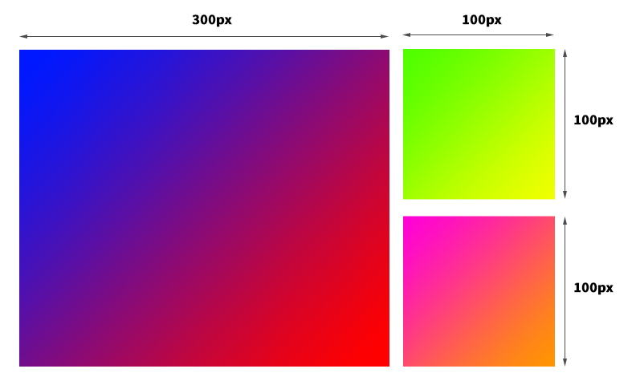
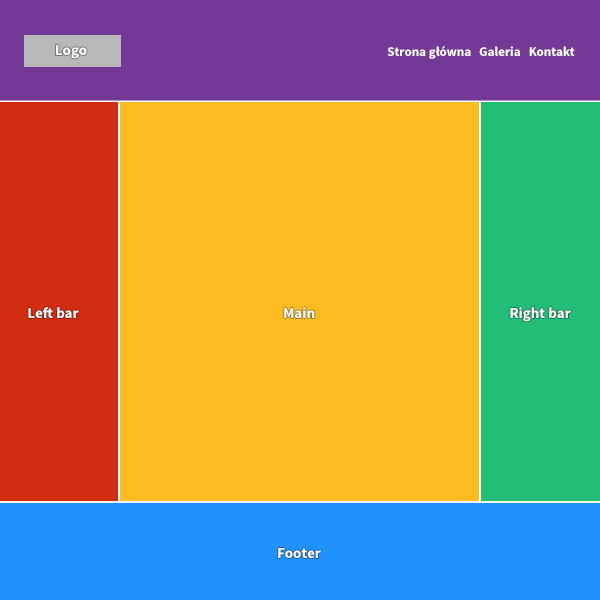

Zadania
===============================

Zadanie 1
---------
Zainstalujmy gulpa i odpalmy kompilację sass.  
W pliku **exercise1.scss** Stwórzmy mapę 5 kolorów:
* ```#f9c00c```
* ``#00b9f1``
* ``#7200da``
* ``#f9320c``
* ``#75D701``

Za pomocą interpolacji i pętli nadaj powyższe kolory jako tła dla elementów o klasach **element-1**, **element-2** itp.

Za pomocą css grid ułóżmy elementy o tych klasach obok siebie. Każdy element powinien mieć 200px wysokości.

Zadanie 2
---------
W pliku **_exercise2.scss** napiszmy mixin o nazwie **gradient**, który przyjmie 2 parametry: kolor1 i kolor2. 

Mixin powinien dodawać elementowi gradientowe tło.   
Gradient taki powinien być ustawiony pod kątem 45 stopni, zaczynać się od koloru1 i kończyć na kolorze2. 

Na razie nie używajmy tego mixina.

Zadanie 3
---------
W pliku **index.html** znajduje się się element o klasie **.exercise3**. 

Nie zmieniając jego zawartości stwórzmy w nim layout, który pokazuje poniższy screen:



Elementy powinny być ustawione za pomocą grida.   
Dodatkowo każdemu elementowi dodajmy gradientowe tło za pomocą mixina, który zrobiliśmy w zadaniu 2.  

Stylowanie dla grida napiszmy w pliku **_exercise3.scss**

Zadanie 4
---------
W pliku **holy-grail.html** jest stworzony kod strony. 

Za pomocą css grid i flexboxa ostylujmy go tak, by wyglądał tak jak na poniższym screenie:



- Minimalna wysokość layoutu to cały ekran.  
- Nagłówek i stopka powinny mieć mieć wysokość 200px.  
- Lewa i prawa belka po 200px szerokości.  
- Przerwa miedzy komórkami grida powinna mieć 5px.

Wewnątrz nagłówka znajduje się logo i nawigacja.  
Pamiętajmy, że jeżeli używamy grida, spokojnie możemy też w jego wnętrzu używać flexboxa.

Całość stylowania napiszmy w pliku **_holy-grail.scss**, który dołączymy w pliku main.scss.