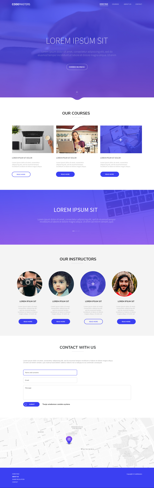
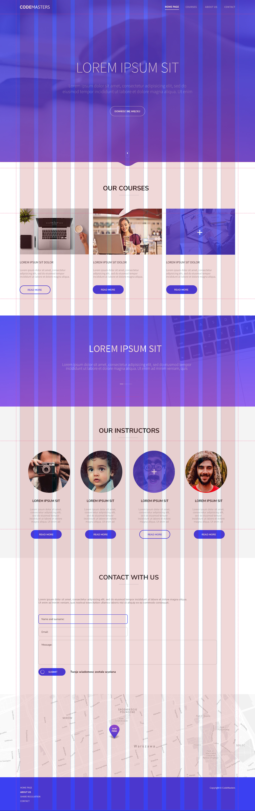
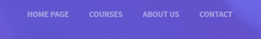
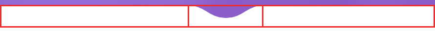
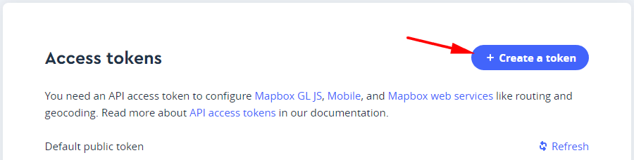
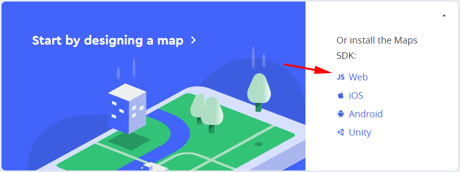

# Warsztat podsumowujący

Podsumujmy ten moduł przykładowym projektem, w którym nie tylko będziemy musieli użyć wiedzy, którą zdobyliśmy podczas ostatnich tygodni, ale i poznamy nowe techniki.

Do przygotowania mamy poniższy layout:

### layout właściwy


### ułożenie elementów


### elementy po najechaniu kursorem


Git
------------------
Zaczynając warsztat stwórzmy na GitHubie swoje repozytorium korzystając ze [strony](https://github.com/new).
1. Zainicjujmy gita w głównym katalogu warsztatu za pomocą polecenia `git init`
2. [Podłączmy adres stworzonego](https://help.github.com/en/articles/adding-a-remote) repozytorium do lokalnego repozytorium za pomocą polecenia:

```
git remote add origin adresNaszegoRepozytorium
```

3. Dodajmy wszystkie lokalne pliki z tego katalogu i skommitujmy.
4. Stwórzmy nową gałąź develop i się na nią przełączmy

```
git checkout -b develop
```

5. Zacznijmy pracę.

6. Po skończeniu pracy zmergujmy gałąź develop do master.


Struktura projektu
------------------
Do tej pory przy pracy edytując pliki scss działaliśmy w katalogu **./scss**.

Takie podejście sprawdzi się przy prostych projektach czy zadaniach.   
Pamiętajmy jednak, że w wielu przypadkach nie tylko scss będą naszymi plikami źródłowymi.   
To samo będzie się tyczyć plików JS, grafiki, którą potem będziemy optymalizować, i podobnych.

Dlatego też bardzo często przy projektach stosuje się podział na 2 katalogu: katalog z plikami źródłowymi (tymi które edytujemy i scalamy), oraz katalog ze stroną wynikową.  
Przykładem templatki która ma taki podział jest https://html5boilerplate.com/, ale w praktyce każda aplikacja którą będziemy w przyszłości budować za pomocą frameworków będzie miała zbliżony podział.

W przypadku tego warsztatu mamy 2 katalogi:
- **src** - w nim znajdują się wszystkie edytowalne przez nas pliki scss i js
- **dist** - strona wynikowa, w której znajduje się html.

My będziemy pisać style i javascript w plikach w katalogu src, natomiast działający w tle gulp będzie na ich bazie tworzył w katalogu dist pliki **css/style.min.css** i **js/bundle.js**.

Kod html będziemy wyjątkowo pisać bezpośrednio w pliku **dist/index.html**.  
Wynika to z tego, że naszego html nie będziemy modyfikować żadnym narzędziem, a i nie będziemy używać tutaj żadnego specjalnego systemu szablonów.

Aby zacząć
----------
Aby zacząć warsztat, w głównym katalogu warsztatu musimy zainstalować wszystkie paczki (`npm i`), a następnie odpalić gulpa poleceniem `gulp`.  
Wszystko będzie przebiegać identycznie do zadań które robiliśmy do tej pory. Jedyna różnicą jest omawiana powyżej struktura katalogów.

Po odpaleniu gulpa, otwórzmy w edytorze plik **dist/index.html** oraz **src/scss/main.scss**.  
Pozostaje zacząć kodować...

Ogólne wskazówki
--------------
- używamy sassa, dlatego starajmy się nasz kod podzielić na oddzielne pliki, a następnie dołączać je w pliku **src/scss/main.scss**. Nie musimy takiego podziału robić w pierwszych minutach programowania layoutu. Zacznijym stylować, a po chwili gdy kodu zrobi się za dużo - podzielmy go na odpowiednie części
- pamiętajmy o strukturze CSS. Na samej gorze ogólne klasy, potem stylowanie poszczególnych elementów, gdzie selektory nigdy nie zaczynają się od znaczników
- w pliku _variables.scss przygotowane są 2 zmienne - kolory, które używane są przy buttonach i gradientach
- layout właściwy ma szerokość 1390px, ale spokojnie możemy ją zmniejszyć - naszym założeniem jest by strona wyświetlała się dobrze na wszystkich rozdzielczościach
- wszystkie grafiki których musimy użyć są w katalogu **dist/images**
- video które użyjemy jako tło baneru znajduje się w katalogu **dist/video**
- na stronie użyty jest font **Open Sans**, który możemy znaleźć na [Google fonts](https://fonts.google.com/specimen/Open+Sans)
- nie wszystko musimy zrobić od razu. Warsztat służy trenowaniu podejścia do programowania podobnych stron. Pamiętajmy - trening czyni mistrza.

Główny banner
------------
Główny banner powinien zajmować całą wysokość ekranu.   
Dodatkowo powinien mieć ustawioną minimalną wysokość gdyby okazało się, że ekran jest za niski (np. użytkownik będzie trzymał telefon horyzontalnie).

W **tle** głównego ekranu znajduje się film video przykryty pół przezroczystym gradientem. Do wstawienia video w tło strony skorzystamy ze znacznika video:
- https://www.w3schools.com/html/html5_video.asp
- https://developer.mozilla.org/pl/docs/Web/HTML/Element/video

Dla różnych przeglądarek powinniśmy dostarczyć różne formaty filmu oraz ustawić mu dodatkowe parametry takie jak automatyczne odtwarzanie, wyłączone kontrolki czy wyłączony dźwięk (dzięki temu na przeglądarkach safari zadziała auto odtwarzanie).

```html
<div class="main-hero-video">
    <video width="100%" height="100%" autoplay buffered loop preload muted>
        <source src="video/674118136.mp4" type="video/mp4">
        <source src="video/674118136.ogv" type="video/ogv">
        <source src="video/674118136.webm" type="video/webm">
    </video>
</div>
```

Aby nasze video znajdowało się w tle bannera i nie wpływało na resztę elementów, powyższy element **.main-hero-video** (nie musi się tak nazywać) powinien być pozycjonowany absolutnie względem swojego rodzica.


Przykładowa struktura (nie pełna!) pokazana jest poniżej:

```html
<div class="main-hero">
    <header class="page-header">
        <div class="container">
            <a href="/" class="logo">
                
            </a>
            <nav class="page-nav">
                <ul class="page-nav-list">...</ul>
            </nav>
        </div>
    </header>

    <div class="main-banner"></div>

    <div class="main-hero-bottom-bar"></div>

    <div class="main-hero-video">
        <video>...</video>
    </div>
</div>
```

Dla elementów typu img i video istnieje właściwość [object-fit](https://developer.mozilla.org/en-US/docs/Web/CSS/object-fit), która działa podobnie do **background: cover**.  
W naszym przypadku dla elementu video musimy nadać właściwość **object-fit: cover**:

```
.main-hero-video  video {
    width: 100%;
    height: 100%;
    object-fit: cover;
}
```

Aby przykryć film przezroczystym gradientem możemy skorzystać z dodatkowego diva, albo wykorzystać pseudoelement, który nadamy dla .main-hero-video.   
Element taki powinien dostać linear-gradient.

Elementy takie jak logo, menu i teksty na banerze możemy wypozycjnować za pomocą grida wewnątrz elementu **.main-hero-content**.  
Do wycentrowania tekstu na środku banera możemy wykorzystać flexa.  
Za pomocą animacji CSS możemy pokusić się tutaj o dodatkowe animacje:  



Wystarczy wykorzystać pseudoelement, który będzie pozycjonowany absolutnie względem każdego linka z osobna.

Podobnie spróbujmy wykonać animację skrolowania, która znajduje się na dole banera:


Dolna belka banera
------------------
W katalogu **dist/images** znajduje się grafika **banner-bottom.svg**, która ma rozmiar **260x50px**.  
Programując dolną belkę głównego baneru wystarczy wstawić 3 elementy (albo wykorzystać ::before i ::after):



Do ustawienia elementów wewnątrz belki można wykorzystać flexa, albo grida.  
Do wypozycjonowania belki na dole baneru można wykorzystać grida, lub pozycjonowanie absolutne względem dolnej krawędzi banera.


Formularz
---------
Skupmy sie tutaj głównie na nadaniu wyglądu.  
Szczególnie interesować nas stan :focus dla inputów, które powinny płynnie zyskiwać niebieskie obramowanie (pokazane jest to na layoucie), oraz ikonka wczytywania, która będzie w przyszłości pokazywać się gdy formularz będzie wysyłany.

**Dla chętnych:** najlepszym rozwiązaniem było by dodać tutaj asynchroniczne wysyłanie formularza wraz z wcześniejszą walidacją.


Mapa - dodatkowe
-----------
Uwaga - mapa jest dodatkową rzeczą, której nie musimy robić.  
Warto jednak zmierzyć się z tym tematem, ponieważ nie raz będzie do nas wracał w realnej pracy.

Do zrobienia google mapy przydadzą nam się strony:
- https://www.latlong.net/ - do ustalenia koordynatów
- https://snazzymaps.com/ - do wyboru templatki
- https://developers.google.com/maps/documentation/javascript/custom-markers - do wstawienia własnego markera
- https://developers.google.com/maps/documentation/javascript/adding-a-google-map - mini tutorial jak dodać mapę na stornę

Aby używać Google Map trzeba wygenerować klucz na stronie https://cloud.google.com/maps-platform/.  
Wymaga to niestety podania danych do karty kredytowej, która w razie większej liczby odwiedzin zostanie obciążona.

Można też alternatywnie skorzystać z https://www.mapbox.com/, który ma darmową rejestrację.  
Po założeniu konta i zalogowaniu się, musimy stworzyć swój klucz klikając przycisk "Create Token".



Po stworzeniu Tokenu, wybieramy Install the Maps SDK i wybieramy Web.



W kolejnym kroku wybieramy Use The Maps CDN.  
Przechodzimy przed kolejne kroki dodać do html odpowiednie wpisy, które są nam przedstawione.  
Aby zmienić styl mapy, klikamy na swój awatar w prawym górnym rogu, a następnie wybieramy "Studio".   
Na stronie, która nam się ukaże wybieramy **New Style** i wybieramy interesujący nas styl. 

Gdy pojawi się kreator stylów wracamy do poprzedniej strony i w stylu który właśnie stworzyliśmy wybieramy "Share & Use".  
Pojawi nam się modal, w którym wybieramy Use. Pojawi nam się przykład kodu, który powinniśmy użyć dla tego stylu.

