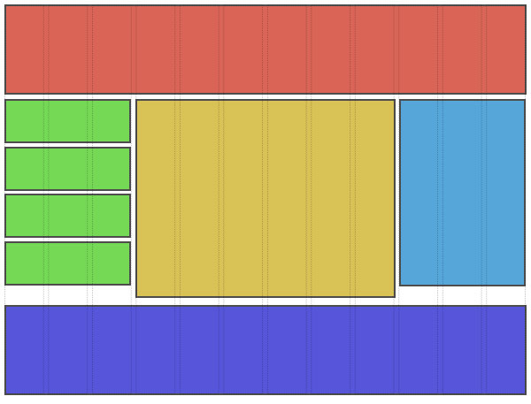

Zadania flexbox grid
====================

Zadanie 1
----------
Stwórzmy własnego 12 kolumnowego grida i umieśćmy go w osobnym pliku.

Zadanie 2
---------
Za pomocą utworzonego grida utwórzmy przykładowy layout:

